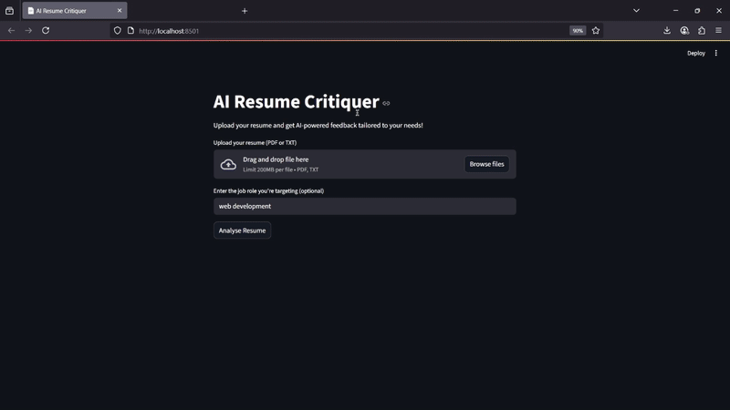

# 🚀 Project 2 – AI Resume Critiquer

An AI-powered resume critique tool built with **Streamlit** and **OpenAI API**.  
Users can upload a resume (PDF or TXT), specify the job role, and receive instant, section-by-section feedback from a Large Language Model (LLM).

Powered by [`uv`](https://github.com/astral-sh/uv) for fast Python dependency management and reproducible environments.



---

## 📚 Learning Reference

This project was built by following this tutorial:

- 🎥 [YouTube Tutorial – Build an AI Resume Critiquer with Streamlit](https://youtu.be/XZdY15sHUa8?si=XhAYTKEsmH7_mwDw&t=1449s)

---

## 🧱 Tech Stack & Libraries

### 🖥 Streamlit  
Used to build the interactive web interface with minimal code.

### 🧠 OpenAI  
Used to analyze the resume content and generate feedback via an LLM.

### 📄 PyPDF2  
Used to read the contents of uploaded PDF resumes.

### ⚡ `uv`  
A modern Python package manager, used here to create a reproducible virtual environment (`pyproject.toml` + `uv.lock`).

---

## 📝 What This App Does

> "Upload your resume using a clean Streamlit UI, specify the job role (e.g., *software engineer*), and click **Analyze**.  
> The app reads the PDF, sends it to OpenAI, and returns suggestions, strengths, and areas for improvement."

Key features:
- Upload resume (PDF or TXT)
- Specify job role (optional)
- Analyze using OpenAI LLM (GPT-4o-mini)
- Get markdown-formatted feedback and suggestions
- Download or copy results

---


## ✅ Getting Started

Follow these steps to run this project locally using [`uv`](https://github.com/astral-sh/uv).

> ✅ **Python 3.10+ is required**

### 1. Clone the Repository

```bash
git clone https://github.com/BensonNgu/Python-AI-Projects.git
cd Python-AI-Projects/project2
```

### 2. Install `uv`

Follow the official instructions to install [`uv`](https://docs.astral.sh/uv/getting-started/installation/), the fast Python package manager used in this project:

👉 [uv Installation Guide](https://docs.astral.sh/uv/getting-started/installation/)

> Make sure you have **Python 3.10+** installed before proceeding.


---

### 3. Create Virtual Environment & Install Dependencies

```bash
uv venv && uv pip install
```

This reads both `pyproject.toml` and `uv.lock` to install *exact* dependencies.

---

### 4. Set Up Environment Variables

This project requires an OpenAI API key.

Create a `.env` file in the root directory and add the following:

```text
OPENAI\_API\_KEY=sk-proj-xxxXXXxXxxXX...
```

> 📹 Need help finding your OpenAI API key?  
Follow this tutorial: [How to Get Your OpenAI API Key (YouTube)](https://youtu.be/XZdY15sHUa8?si=Sa9U4DFNiB7BkFGT&t=432s)

> 🔐 **Do not commit your `.env` file** — it contains sensitive credentials.


---

### 4. Activate the Virtual Environment

#### On macOS/Linux:

```bash
source .venv/bin/activate
```

#### On Windows:

```bash
.venv\Scripts\activate
```

---

### 5. Run the Project

Using `uv`:

```bash
uv run streamlit run main.py
```

(as long as your virtual environment is activated)

---

## 🛠 Project Structure

```
project1/
├── .venv
├── .env
├── main.py
├── pyproject.toml
├── uv.lock
└── README.md
```